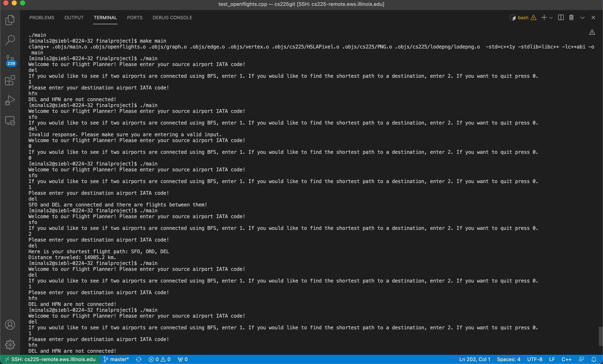
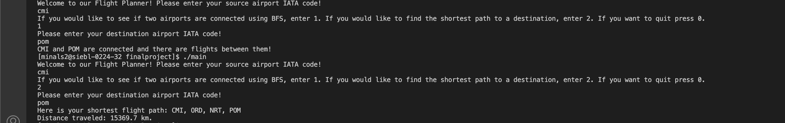

# Final Project: Open Flights Search Tool
Group Members: Rithika Bhattaram, Violetta Dabros, Palak Purwar, Minal Singh

# Project Structure
This project aims to create a open flights search tool that takes in a source airport IATA code and a desination airport IATA code. We used airports.dat and routes.dat to parse through them and create a graph based on the information we needed. Based on these inputs, we have implemented BFS, to create a list of all connected airports based on a source airport. We also implemented Dijkstra’s Algorithm to create the shortest path between two airports. These data files are present in the data folder(finalproject/data).

* routes.dat URL: https://raw.githubusercontent.com/jpatokal/openflights/master/data/routes.dat
* airlines.dat URL: https://raw.githubusercontent.com/jpatokal/openflights/master/data/airlines.dat

You will find all three algorithms in finalproject/openflights.cpp, where we use a graph object, which already has all of the necessary vertices and edges, and use that object to run BFS, Dijkstra’s Algorithm, and Betweenness Centrality.

# Final Presentation Link

Here's the link to our final presentation video: https://www.youtube.com/watch?v=cLRg3TvoMAQ

# How to Run our Program

## Downloading Project

Open up an IDE and paste in the command below into your terminal to download our project

`git clone https://github-dev.cs.illinois.edu/cs225-fa21/ppurwar2-minals2-rbhatt21-vdabro2`
## Main

You can run the program using main! First start by using the dataset of airports of your choice! You will find two links to datasets near the top. You can use the datasets we provided, or if you would like to use your own, put your dataset in  finalproject/data as a txt file and copy the path in the appropriate spot in main. 

After this, you can run our program by running main using the commands below in the terminal and following the instructions it gives you. It will ask you which algorithm you would like to run, as well as the necessary IATA codes. After inputting that, it will give you the results you want in the terminal!

`make main`

`./main`
<!-- 
The main method also includes some additional input if you would like to play around with the inputs. You can run `./main -h` or `./main --help` for more information on the usage type. The result should print something like:

`Usage: ./main [nodes file] [edges file]`

For example, we provided a fake dataset so you could run the following:

`./main ../data/nodes.csv ../data/edges.csv` -->

# Running Test
## Tests

The tests we have created verify the graph information, such as weights for given airport connections. They also make sure that BFS is producing the correct output as well as Dijkstra’s based on our calculations. We used multiple airports to make sure there is no errors in certain vertices of the graph. The tests are available to view in the tests folder(finalproject/tests/test_openflights.cpp) of our project. 

You can run our test suite using this command in the terminal:

`make test`

`.\test`

and you should see the success on all parts.

If you would like to run a certain test and not the whole test suite, run these commands in the terminal:

`make test`

`.\test "TEST NAME"`

and insert the test name where listed.

# Example Outputs

## Example about the results in main:

## Testing output:

